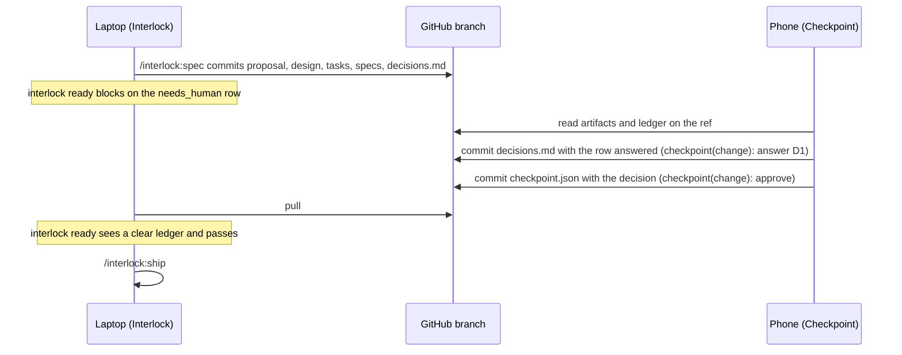

# How Checkpoint works, and how it fits Interlock

Checkpoint is the phone-side half of Interlock's human checkpoint. This page
explains the problem it solves, what was built, exactly where it touches the
Interlock plugin (the `specflow` repository), and which parts of that
integration exist today versus still have to land on the Interlock side.

## The problem

Interlock's workflow has one deliberate stop. `/interlock:spec` writes a
change's artifacts and then halts for a human read; `/interlock:ship` runs
start-to-commit with no questions. The gate between them is `interlock ready`,
which refuses to continue while the change's decision ledger,
`openspec/changes/<change>/decisions.md`, still carries a `needs_human` row,
an invalid row, or no ledger at all.

Both the stop and the ledger lived only in a laptop terminal. An unattended
run was unattended right up to the moment it needed a person, and then it
waited for someone to sit down at that laptop. Checkpoint moves that read to a
phone: read the artifacts, answer the row, approve or send back, from anywhere.

## What was built

A Next.js 16 app, phone-first at 375 px, that treats a GitHub branch as its
only backend. There is no database and no channel between the phone and the
laptop. Every read is a read of a file on a ref. Every write is a commit.

The app does four things:

1. **Inbox.** Lists every active change under `openspec/changes/` on a ref
   (the archive folder is skipped), with its ledger status ("1 needs you",
   "clear", "ledger missing"), task and wave counts, and decision state.
   Blocking changes sort first.
2. **Change page.** Renders `proposal.md`, `design.md`, `tasks.md`, the delta
   specs under `specs/**`, and the ledger, in the ten-minute reading order
   Interlock's own checkpoint doc prescribes. The header shows the ref and the
   short head SHA it was rendered from, so the owner knows which branch they
   are judging.
3. **Answer a row.** A `needs_human` row gets one-tap option chips parsed from
   its question text plus a free-text field. Submitting flips the row to
   `agent_resolved`, writes the answer into `resolution` and the evidence
   `human decision <YYYY-MM-DD> via Checkpoint`, and commits `decisions.md`
   back to the branch.
4. **Approve or send back.** Writes `openspec/changes/<change>/checkpoint.json`
   with the decision and the head SHA it was decided against. Approve is
   refused, in the UI and on the server, while the ledger still blocks. Send
   back is always available and requires a note.

Access is gated by a shared key exchanged for a 30-day HMAC-signed httpOnly
cookie, checked on every route by the Next.js request interceptor. With no
key configured, every gated route answers 503. The app fails closed.

### Module map

| Area | Files | Role |
|---|---|---|
| Git host adapter | `src/lib/githost/*` | One contract (`resolveRef`, `readFile`, `listDir`, `writeFile`) with two implementations: the GitHub contents API and a local fixture tree with an in-memory write overlay. `guard.ts` refuses any write that is not `decisions.md` or `checkpoint.json` directly under a change directory, before any request is made. |
| Ledger port | `src/lib/ledger/ledger.ts` | TypeScript port of Interlock's `lib/ledger.mjs`. `answerRow` is the one addition: it re-renders a single row and splices it in at the parsed line, so every other byte of the file is untouched. |
| Options | `src/lib/ledger/options.ts` | Turns "a cookie, Deployment Protection, or Cloudflare Access?" into at most four chips. |
| Task counts | `src/lib/tasks/tasks.ts` | Checkbox and `## N.` wave counts, using the same regexes as Interlock's `artifacts.mjs`. |
| Checkpoint file | `src/lib/checkpoint/checkpoint.ts` | Tolerant zod schema for `interlock.checkpoint/1`, decision merge, risk and staleness views. |
| Loader and actions | `src/lib/change/load.ts`, `src/lib/change/actions.ts` | Artifacts on a ref become a view model; the two writes are pure orchestration over the adapter with blob-SHA concurrency. |
| Access gate | `src/proxy.ts`, `src/lib/auth/session.ts`, `src/app/api/session/route.ts`, `src/app/login/` | The shared-key session. Removable as a unit if decision D1 is answered differently. |
| Screens | `src/app/page.tsx`, `src/app/changes/[name]/page.tsx`, `src/components/*` | Inbox, change page, tabs, ledger panel, answer form, decision bar. |

## How it integrates with Interlock (specflow)

Checkpoint never imports Interlock and never calls it. The two repositories
meet only through files on the branch. There are three touch points, and
their state today differs.

### 1. The decision ledger: shared today, and fully effective

This is the real integration. `interlock ready` on the laptop reads
`decisions.md` with `lib/ledger.mjs` and blocks on any `needs_human` row or
any invalid row. Checkpoint edits that same file with a parser and serializer
ported from that same module.

Parity is pinned rather than assumed. `scripts/gen-ledger-fixtures.mjs`
imports the real `ledger.mjs` from `INTERLOCK_LIB_DIR` and writes, for each
hand-written `fixtures/ledger/<name>.md`, a `.parsed.json` and a
`.serialized.md`. The unit tests compare the port against those golden files,
and `fixtures/ledger/VERSION` records which Interlock produced them
(currently 0.2.0). After an Interlock release, regenerate with:

```sh
INTERLOCK_LIB_DIR=~/IdeaProjects/specflow/lib npm run gen:ledger-fixtures
```

Because the write path splices one row instead of re-serializing the file, a
laptop-authored `decisions.md` comes back with a one-line diff, and the
evidence cell follows the form Interlock's `shared/DECISION-LEDGER.md`
documents for a human answer. The row Checkpoint writes is one
`interlock ready` accepts, so answering from the phone unblocks the ship gate
on the laptop with no Interlock change required.

### 2. The `checkpoint.json` marker: written today, not yet read by Interlock

Checkpoint writes `openspec/changes/<change>/checkpoint.json` on approve or
send back:

```json
{
  "schema": "interlock.checkpoint/1",
  "change": "add-user-auth",
  "request": { "...": "written by the sender, optional" },
  "decision": {
    "state": "approved",
    "note": "",
    "decidedAt": "2026-09-05T04:00:00Z",
    "decidedBy": "checkpoint",
    "headSha": "0123456789abcdef0123456789abcdef01234567"
  }
}
```

The reader writes only `decision`, replaces any previous decision, and
preserves `request` and any unknown top-level field. `decision.headSha` is the
branch head at the moment of decision; when the branch moves past it the app
labels the decision stale and offers Approve again.

As of Interlock 0.2.0, nothing in specflow reads this file. A search of its
`lib/`, `bin/`, `skills/`, `workflows/`, and docs finds no reference to
`checkpoint.json` or the `interlock.checkpoint` schema. The marker is
therefore an audit record on the branch today, not a gate input. Approve on
the phone does not by itself let `interlock ready` pass; the ledger being
clear does. This is fail-closed by design: a marker the laptop side does not
know about reads as "not approved".

### 3. The push to the phone: assumed, not built

The design assumes a sender in specflow that writes a `request` block into
`checkpoint.json` (head SHA, risk class and signals, task and ledger counts)
and sends an ntfy push whose click URL is `/changes/<change>?ref=<branch>`.
Checkpoint is only the click target; it never talks to ntfy.

That sender does not exist in specflow yet either. Checkpoint tolerates its
absence: risk shows as `unobserved`, and every task and ledger count is
computed from `tasks.md` and `decisions.md` on the ref, never taken from the
sender. Until the push exists, the owner opens the app and reads the inbox.

### The flow end to end



Steps that exist today are the ledger read and write and the ready gate on
the ledger. Steps still owned by specflow are the push before the phone read
and any consumption of `checkpoint.json`.

## Safety properties worth knowing

- **Two files, one repository.** The adapter's path guard runs before any
  network call. The GitHub token is fine-grained, Contents read and write on
  the one repository named in `CHECKPOINT_REPO`, and is never logged.
- **No stale writes.** Every write carries the blob SHA the owner was shown.
  GitHub rejects a stale SHA; the app reloads the file and says so. Nothing
  is retried.
- **No invented numbers.** Every count carries its denominator and is
  computed on the ref. A value the sender did not record is shown as
  `unobserved`, never as zero or blank.
- **Mirrors the laptop gate.** Approve is disabled for the same reasons
  `interlock ready` would block: a `needs_human` row, an invalid row, a
  missing ledger, an unreadable ledger.

## What is still open

- **Decision D1** in the archived change's ledger is still `needs_human`: how
  the app itself is gated. The shared-key cookie is the implemented default.
  Vercel Deployment Protection or Cloudflare Access would replace the access
  gate files listed in the module map and nothing else.
- **Interlock-side work**, in specflow: a sender that writes the `request`
  block and pushes via ntfy, and a `ready` check that reads
  `checkpoint.json` so that a phone approval is an explicit gate input rather
  than only the ledger being clear.

## Where the design came from

The UI was implemented from a Claude Design comp briefed from this repo
(design decision D21 in the archived change), using Interlock's Nocturne
palette so Checkpoint reads as the phone surface of the Interlock report. The
tokens now live in `src/app/globals.css`, and the archived change under
`openspec/changes/archive/2026-09-05-build-checkpoint-reader/` records the
decision. The brief, the comp, and its transcription were inputs to the build
and have been removed from `docs/`; the shipped components are the reference.
